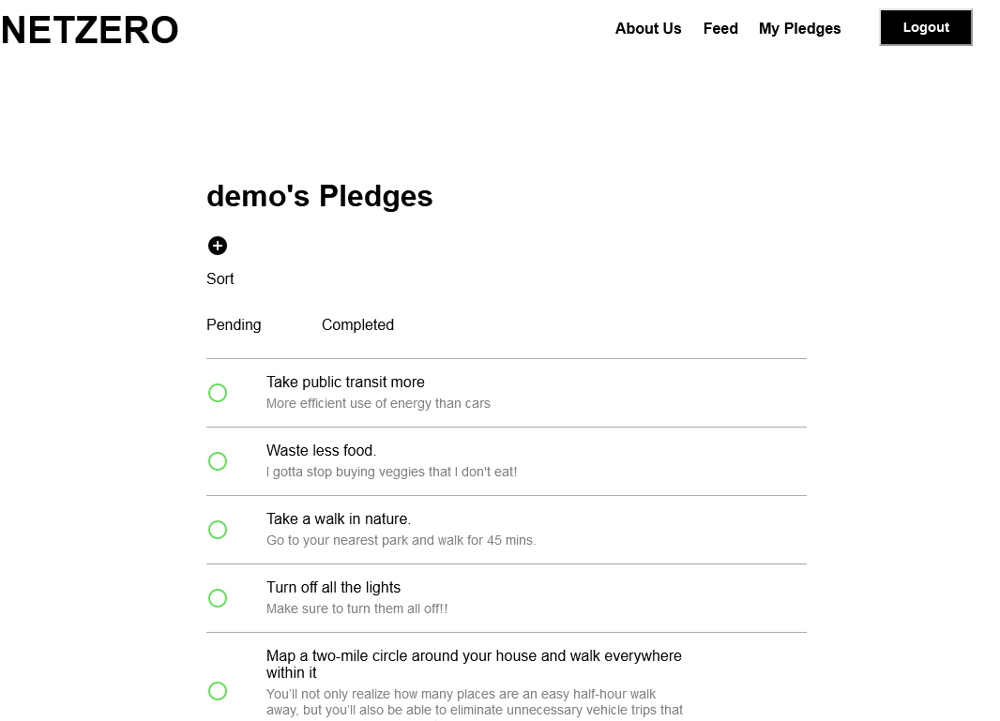

# net-zero

Net Zero is an easy-to-use pledge tracker that reminds and motivates you to commit to climate-change-curbing efforts every day and track your progress.
With our minimal and intuitive design, Net Zero pledge tracker is here to make your building and monitoring pledges become more effective and completely effortless. Together we have the power to get to net zero carbon emissions by 2050.

[Net Zero](https://netzero-application.herokuapp.com/)

Pledge Index            |  Profile
:-------------------------:|:-------------------------:
 | 

## Deployment

Clone this repo.

Create a MongoDB instance.

Set up the appropriate keys for your MongoDB instance in the config folder. For dev purposes you will need to create a new `keys_dev.js` file.

Run `npm install`, `npm frontend-install`, and then `npm run dev`.

Navigate your browser to `localhost:3000`


## Technologies Used
* React / Redux
* Mongoose / Mongo DB
* HTMl / CSS / Javascript
* Amazon Web Services (S3 Storage)

## Group Members

### Angela Turi - Team Lead
Angela was responsible for the app concept, and the overall design of the front end and back end. She wrote the components for the logged-in user profile page, and worked with Philip to implement Redux actions and reducers.

### Philip Lowe - Front End Lead
Philip was responsible for implementing the ReactJS front end. Philip wrote the components for the title page, session management, pledge feed, individual pledge page, and individual user pages. He also worked with Mohammad to design and implement the backend.

### Mohammad Taher - Back End Lead
Mohammad was responsible for the MongoDB/Mongoose back end. Mohammad implemented the API for our app, which included routes for Users, Pledges, Comments, and Follows.

### Sebastian Sanchez - Flex
Sebastian was primarily responsible for defining our app's look and feel, using his design sensibility to create a clean and modern user interface. He also helped us out wherever necessary, providing a second set of eyes when bugfixing.

## Key Features
* User Profile:

The to-do list will be a user's main source of truth for which pledges they commit to. Upon navigation to the user's profile page, users can toggle between their 'pending' and 'completed' pledge lists as well as filter between 'public' and 'private' pledges. At time of creation, pledges are automatically inputted onto the 'pending' pledge list. Pledges on the 'pending' list that are checked off will be moved onto the 'completed' pledge list.


```Javascript
const renderPledges = () => {
    return items.map((pledge) => (
      <div className="item" key={pledge._id} >
        <RadioButtonUncheckedIcon
          className="check"
          onClick={() => removeItem(pledge._id)}
        />
        <ul className="ul-pending-pledges">
          <li>{pledge.title}</li>
          <li className="pending-pledge-description">{pledge.description}</li>
        </ul>
        {(pledge.user._id === userId) ? <button
          className="button-pledge-page"
          onClick={(e) => handleEdit(e, pledge._id)}>
          Edit
        </button> : null}
        <Link to={`/pledges/${pledge._id}`}
              style={{ textDecoration: "none" }}
              >
          <button
            className="button-pledge-page">
            View
          </button>
        </Link>
      </div>
    ));
  };
```

* Create pledge:

Users can add specifications for each pledge, including which one of the pre-selected categories (built environment, energy, industry, food, environmental justice, transport, finance, sustainable living, nature, and policy) the pledge should belong to and whether the pledge is public or private.

```Javascript
const handleCreatePledge = (e) => {
    e.preventDefault();
    let createPledge = (pledge) => dispatch(makePledge(pledge));

    let pledge = {
      ...formData,
      public: isPublic,
      category: selectedCategory,
    }

    createPledge(pledge)
    .then((res) => {
      let pledge = res.pledge.data;
      dispatch(followPledge(pledge._id));
      
      history.push(`/pledges/${pledge._id}`);
    })
    toggleAddPledgeModal();
  };
```

* Feed:

Users can view the public pledges of other Net Zero users on their home feeds. On the home feed, they also have the ability to follow another's pledge.

```Javascript
  toggleFollow(pledge) {
    //add userId to pledge follow array
    if (pledge.follows.includes(this.props.currentUser.id)) {
      this.props.unfollowPledge(pledge._id);
    } else {
      this.props.followPledge(pledge._id);
    }
    //update state
  }
```

* Commenting:

Users can comment on another user's pledge upon navigation to the pledge's show page.

```Javascript
  handleSubmit(e) {
    e.preventDefault();
    let comment = {
      text: this.state.commentText,
      authorName: this.props.currentUser.handle,
    };

    this.setState({
      commentText: "",
    })
    this.props.createCommentOnPledge({
      pledgeId: this.props.match.params.pledgeId,
      ...comment,
    });
  }
```