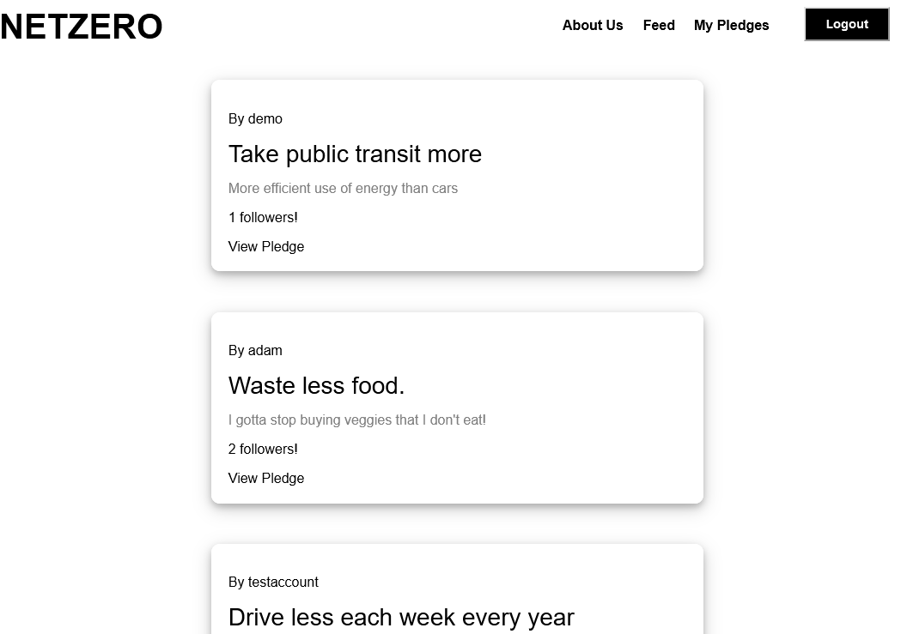

# net-zero

Net Zero is an easy-to-use pledge tracker that reminds and motivates you to commit to climate-change-curbing efforts every day and track your progress.
With our minimal and intuitive design, Net Zero pledge tracker is here to make your building and monitoring pledges become more effective and completely effortless. Together we have the power to get to net zero carbon emissions by 2050.

[Net Zero](https://netzero-application.herokuapp.com/)

Notes            |  Notebooks
:-------------------------:|:-------------------------:
 | 

## Technologies Used
* React / Redux
* Mongoose / Mongo DB
* HTMl / CSS / Javascript
* Amazon Web Services (S3 Storage)

## Key Features
* Add pledges to your pledge list:

The to-do list will be a user's main source of truth for which pledges they commit to. Upon navigation to the user's profile page, users can toggle between their 'pending' and 'completed' pledge lists as well as filter between 'public' and 'private' pledges. At time of creation, pledges are automatically inputted onto the 'pending' pledge list. Pledges on the 'pending' list that are checked off will be moved onto the 'completed' pledge list.

* Create pledge:

Users can add specifications for each pledge, including which one of the pre-selected categories (built environment, energy, industry, food, environmental justice, transport, finance, sustainable living, nature, and policy) the pledge should belong to and whether the pledge is public or private.

* Feed:

Users can view the public pledges of other Net Zero users on their home feeds. On the home feed, they also have the ability to follow another's pledge.

* Commenting:

Users can comment on another user's pledge upon navigation to the pledge's show page.
